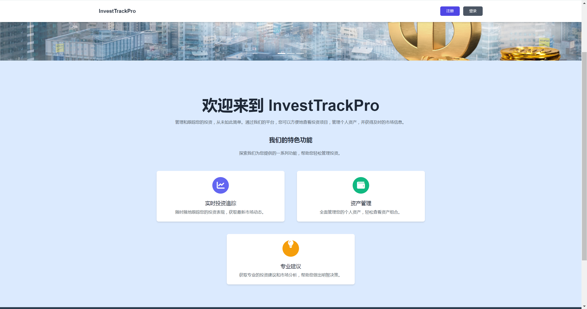

# 投资组合管理网站(Java课程期末项目|大作业)

此仓库包含一个开源的投资组合管理网站，是我作为 Java 课程期末项目的一部分开发的。该网站使用 JSP（JavaServer Pages）和 Servlets 开发，重点是提供一个用户友好的界面来管理和可视化投资组合。

## 功能

- **用户注册和登录**：用户可以安全地注册和登录，以管理他们的投资组合。
- **投资组合管理**：添加、更新和跟踪各种资产的投资。
- **数据报表查看**:查看投资总收益、持有收益等数据和图表分析
- **基于 Servlet 的后端**：使用 Java Servlets 进行高效的数据处理。

## 屏幕截图



## 使用的技术

- **前端**：JSP、HTML、CSS、JavaScript
- **后端**：Java Servlets、JDBC
- **数据库**：MySQL
- **服务器**：Apache Tomcat

## 安装和设置

1. 克隆仓库：
   ```sh
   git clone https://github.com/TinkerAC/InvestTrackPro.git
   ```
2. 将项目导入到你喜欢的 IDE（例如 IntelliJ IDEA、Eclipse）。
3. 使用提供的 SQL 脚本（`database.sql`）设置 MySQL 数据库。
4. 将项目部署到 Apache Tomcat 服务器上。

## 使用方法
- 部署后，打开浏览器并导航到 `http://localhost:8080/InvestTrackPro`。
- 注册新用户或使用已有的凭据登录。
- 开始添加你的投资并可视化你的投资组合。

## 贡献
~~欢迎 fork 本仓库并提交 pull requests。所有的贡献都是非常欢迎的，让这个项目变得更好！~~
项目基本不再维护.
## 许可证

本项目采用 MIT 许可证。详情请参阅 `LICENSE` 文件。

## 鸣谢

- 感谢我的 Java 课程老师在整个项目中的指导。
- 项目的灵感来自市面上常见的投资管理工具。

---

# 如果对你有帮助,请给我一颗小星星⭐!
